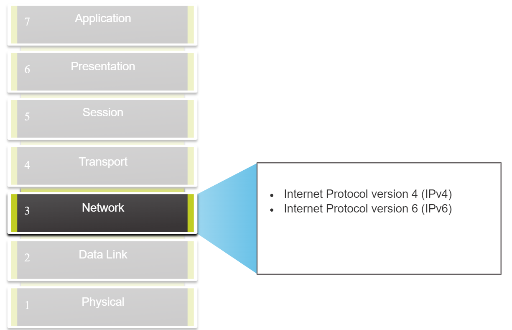
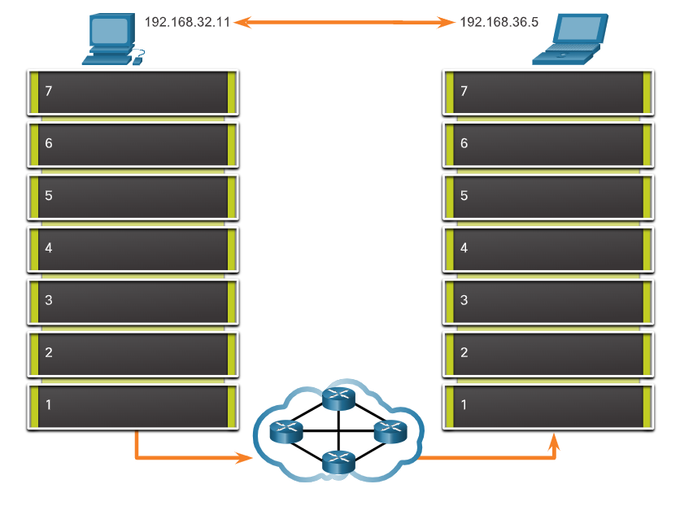

# 8-network-layer

Explain how the network layer uses IP protocols for reliable communications.

## 8.1.1 The Network Layer

The network Layer, or OSI Layer 3, provide services to allow end device to exchange data across network. As show in this [figure](./img/network-layer.png), IP version 4 (IPv4) and (IPv6), are the principle network layer communication protocols. Other network layer protocols include routing protocols such as Open Shortest Path First (OSPF) and messaging protocols such as Internet Control Message Protocol (ICMP).

## Network Layer Protocols

.

To accomplish end-to-end communications across network boundaries, network layer protocols perform four basic operations:

- **Addressing end devices** - End devices must be configured with a unique IP address for identification on the network.
  
- **Encapsulation** - The network layer encapsulates the protocol data unit (PDU) from the transport layer into a packet. The encapsulation process adds IP header information, such as the IP address of the source (sending) and destination (receiving) hosts. The encapsulation process is performed by the source of the IP packet.
  
- **Routing** - The network layer provides services to direct the packets to a destination host on another network. To travel to other networks, the packet must be processed by a router. The role of the router is to select the best path and direct packets toward the destination host in a process known as routing. A packet may cross many routers before reaching the destination host. Each router a packet crosses to reach the destination host is called a hop.
- **De-encapsulation** - When the packet arrives at the network layer of the destination host, the host checks the IP header of the packet. If the destination IP address within the header matches its own IP address, the IP header is removed from the packet. After the packet is de-encapsulated by the network layer, the resulting Layer 4 PDU is passed up to the appropriate service at the transport layer. The de-encapsulation process is performed by the destination host of the IP packet.

`
Unlike the transport layer (OSI Layer 4), which manages the data transport between the processes running on each host, network layer communication protocols (i.e., IPv4 and IPv6) specify the packet structure and processing used to carry the data from one host to another host. Operating without regard to the data carried in each packet allows the network layer to carry packets for multiple types of communications between multiple hosts.`

click this [link](https://www.youtube.com/watch?v=_CfJI0NGf80) to see how data demonstrate in the OSI layer.

and this figure shows steps
